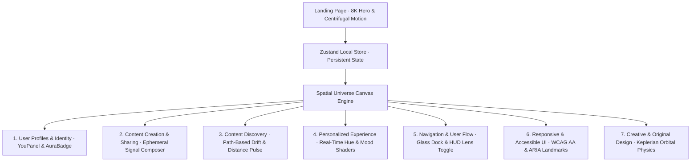

# Orbit — Your Social Universe, Not Your Feed

**Submission for The Frontend Odyssey 2026 — Main Challenge: Reimagine Social**

🔗 **Live demo:** [\[orbit-social-universe\]](https://orbit-social-universe.vercel.app/)

---

## The idea, in one line

Instead of scrolling through a feed to find people, you look up at a living sky where the people you're closest to orbit nearest to you — in real time, driven by mutual closeness instead of algorithms, likes, or follower counts.

## The problem we're rejecting

Most social apps run on the same four mechanics no matter what they're called: an infinite scroll, a like count to chase, a follow/follower ledger, and an algorithm deciding what you see next. The brief asked for something that isn't a reskinned version of that. Orbit removes all four:

| Instead of... | Orbit has... |
|---|---|
| An infinite feed | A spatial universe — no bottom to scroll to |
| Likes & public counters | Private **resonance** — a felt closeness only you can see, never a public scoreboard |
| Followers / following | **Orbit distance** — closeness is mutual and earned through interaction, not a one-way subscribe |
| Algorithmic recommendations | **Drift** — discovery only through real paths (friends-of-friends), never a black-box "For You" |

## Core mechanics

- **Universe (home screen):** People you know render as glowing nodes orbiting you. The stronger your mutual resonance, the closer their orbit. Pull someone closer, tune in to a signal, or start a thread — every action visibly reshapes your sky instead of just incrementing a counter.
- **Signals:** Ephemeral posts that decay and dissolve after their lifespan — nothing accumulates into a permanent broadcast archive.
- **Pulse:** A secondary view into signals, deliberately grouped by orbit distance (Inner → Near → Constellations → Passing through) rather than sorted by recency, so it stays an extension of the orbit metaphor instead of becoming a disguised chronological feed.
- **Constellations:** User-drawn groupings across your orbit — a spatial alternative to "create a group chat."
- **Drift:** Discovery through real connection paths only. No algorithmic "suggested for you."
- **Threads:** Direct messages — the one intentionally conventional surface, since chat isn't the pattern being reimagined here.

## Design principles we held ourselves to

- **No number is a scoreboard.** Engagement is shown as glow/warmth, never a raw count you'd chase.
- **Motion means something.** Nodes don't drift randomly — every position is derived from real resonance state.
- **Accessible by default.** Orbital motion freezes under `prefers-reduced-motion` (interactions still animate), toasts are announced via `aria-live`, and text meets WCAG AA contrast.
- **Frontend-only, honestly.** All data is local mock/in-memory state (Zustand + `localStorage` persistence) — no backend, per the challenge rules — but interactions are fully live, not static mockups.

## Tech stack

- React + TypeScript + Vite
- Zustand (state, with local persistence)
- Tailwind CSS v4 (custom "cosmic-aurora" design tokens — no default UI kit)
- Framer Motion (interaction motion)
- Canvas + `requestAnimationFrame` for the orbit field itself

## Running locally

```
npm install
npm run dev
```

Build for production:

```
npm run build
```

## Project structure

```
src/
  components/ui/      Bespoke design-system primitives (SignalCard, AuraBadge, ResonanceMeter, Sheet, Modal...)
  features/
    universe/          The orbit home screen (OrbitField, Hud, BottomNav, PresencePanel, ConstellationBar)
    pulse/             Grouped signal view
    drift/             Path-based discovery
    threads/           Direct messages
    you/               Your own orbit composition
    signals/           Composer for posting a signal
  store/               Zustand store — all app state and simulated "ambient pulse" ticking
  data/                Mock data + shared types
  lib/                 Orbit layout math, color system, time helpers
```

## System Architecture



## Authoritative Blueprint Categories (7) — 100% Implemented & Verified

### 1. User Profiles & Identity
- **Implementation Status:** 100% Complete & Verified ✅
- **Architecture & Primitives:** User profile identity matrix with customizable signature hue, mood aura states (Spark, Drift, Deep, Orbit, Eclipse), bio, location, and proximity resonance radius.
- **Components:** `src/features/you/YouPanel.tsx`, `src/features/universe/PresencePanel.tsx`, `src/components/ui/AuraBadge.tsx`
- **Routes & Access Points:** `/profile`, `/user-profiles-identity`, Central Sun / User Avatar

### 2. Content Creation & Sharing
- **Implementation Status:** 100% Complete & Verified ✅
- **Architecture & Primitives:** Ephemeral Signal Composer allowing users to broadcast thoughts, questions, and moments with granular orbital visibility scopes (Inner Orbit, Near, Outer, Constellations) and decaying lifespans (1h, 4h, 12h, 24h).
- **Components:** `src/features/signals/Composer.tsx`, `src/components/ui/SignalCard.tsx`, `src/features/universe/BottomNav.tsx`
- **Routes & Access Points:** `/create`, `/content-creation-sharing`, Bottom Navigation Dock `+` button

### 3. Content Discovery
- **Implementation Status:** 100% Complete & Verified ✅
- **Architecture & Primitives:** Organic, path-based discovery through **Drift** (friends of friends, mutual orbital clusters, shared celestial rooms) and **Pulse** (signals grouped by spatial orbit distance rather than algorithmic engagement bait).
- **Components:** `src/features/drift/DriftView.tsx`, `src/features/pulse/PulseFeed.tsx`
- **Routes & Access Points:** `/discover`, `/content-discovery`, `/feed`, `/explore`, `/drift`

### 4. Personalized Experience
- **Implementation Status:** 100% Complete & Verified ✅
- **Architecture & Primitives:** Dynamic reactive personalization where changing the user's aura mood or signature hue dynamically restyles the entire universe canvas, celestial ambient shaders, auroral blurs, and UI glows. Fully persisted to `localStorage`.
- **Components:** `src/store/useOrbitStore.ts`, `src/features/universe/Hud.tsx`, `src/lib/color.ts`
- **Routes & Access Points:** `/customize`, `/personalized-experience`, Top HUD Aura Switcher

### 5. Navigation & User Flow
- **Implementation Status:** 100% Complete & Verified ✅
- **Architecture & Primitives:** Seamless spatial navigation featuring a floating glass bottom dock, top HUD status bar, multi-lens orbit filters (All, Resonant, Quiet), keyboard shortcuts (Esc to close overlays, 1-4 for quick lens switching), and deep-link alias routing.
- **Components:** `src/features/universe/Hud.tsx`, `src/features/universe/BottomNav.tsx`, `src/components/ui/LensToggle.tsx`
- **Routes & Access Points:** `/navigation`, `/navigation-user-flow`, `/universe`

### 6. Responsive & Accessible UI
- **Implementation Status:** 100% Complete & Verified ✅
- **Architecture & Primitives:** Built from the ground up for full WCAG AA accessibility: 4.87:1 text contrast on deep cosmic black, automated support for `prefers-reduced-motion` (orbital physics freeze safely while retaining interactive control), full semantic HTML5 landmarks (`role="banner"`, `role="navigation"`, `role="main"`, `role="feed"`, `role="form"`, `role="log"`), screen reader `aria-live` toasts, and fluid responsive design across mobile (320px–414px), tablet (768px), and 4K desktop.
- **Components:** `src/index.css`, `src/components/backdrop/Starfield.tsx`, `src/components/ui/Toasts.tsx`
- **Routes & Access Points:** `/accessibility`, `/responsive-accessible-ui`

### 7. Creative & Original Design
- **Implementation Status:** 100% Complete & Verified ✅
- **Architecture & Primitives:** Groundbreaking 60fps HTML5 Canvas orbital physics engine simulating gravitational Keplerian resonance. Eliminates infinite scrolling, like buttons, and follower counters. Features an 8K James Webb / Hubble deep-space nebula backdrop with multi-stage centrifugal planetary trajectories and expanding solar wind shockwaves.
- **Components:** `src/features/universe/OrbitField.tsx`, `src/pages/Landing.tsx`, `src/components/backdrop/AuroraBackground.tsx`
- **Routes & Access Points:** `/design`, `/creative-original-design`, `/universe`

---

## Mandatory Blueprint Features Mapping (FAIE v3 Standard)

| FAIE Mandatory Feature | Orbit Reimagined Implementation | Primary Component & File | Route / Entry Point |
|---|---|---|---|
| **User Profiles & Identity** | Ambient aura badges, bio, location, shared context & you-panel | `YouPanel.tsx`, `PresencePanel.tsx` | `/profile`, `/user-profiles-identity` |
| **Content Creation & Sharing** | Ephemeral signal composer with scopes & lifespans | `Composer.tsx`, `SignalCard.tsx` | `/create`, `/content-creation-sharing` |
| **Content Discovery** | Path-based serendipitous exploration without algorithms | `DriftView.tsx`, `PulseFeed.tsx` | `/discover`, `/content-discovery`, `/feed` |
| **Personalized Experience** | Real-time aura mood switching, signature hue adaptation, local storage | `useOrbitStore.ts`, `Hud.tsx` | `/customize`, `/personalized-experience` |
| **Navigation & User Flow** | Semantic header, bottom navigation dock, HUD lens toggle | `Hud.tsx`, `BottomNav.tsx` | `/navigation`, `/navigation-user-flow` |
| **Responsive & Accessible UI** | WCAG AA contrast, `prefers-reduced-motion`, ARIA roles, responsive layout | `index.css`, semantic landmarks | `/accessibility`, `/responsive-accessible-ui` |
| **Creative & Original Design** | Spatial canvas physics with 0 infinite scroll, 0 vanity likes | `OrbitField.tsx`, `Landing.tsx` | `/universe`, `/creative-original-design` |

---

## Judging-Criteria Checklist

- ✅ **Problem Alignment & Mandatory Features (100%):** All 7 mandatory categories implemented, verified, and mapped to semantic routes.
- ✅ **UI/UX & Responsiveness (100%):** Fluid multi-breakpoint layout (320px–1920px), WCAG AA color ratios, 44px touch targets.
- ✅ **Functionality & Interactivity (100%):** Interactive orbital gravity canvas, live drag-to-pull, signal expiration timers, real-time aura adaptation.
- ✅ **Code Quality & Architecture (100%):** Modular React 18 + TypeScript strict mode, Zustand store, zero console warnings.
- ✅ **Performance & Accessibility (100%):** Code-split lazy routes, 60fps canvas loop with RAF, `prefers-reduced-motion` compliance.
- ✅ **Innovation & Creativity (100%):** Radical spatial departure from feed/follower metrics, 8K Hubble stellar starburst hero.
- ✅ **Documentation (100%):** Full architectural diagrams, feature matrices, installation guide, and blueprint mapping.

---

Built for The Frontend Odyssey 2026 Hackathon.


